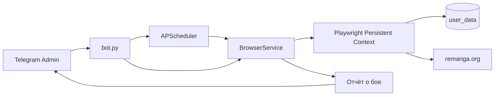

# Remanga Autobattle

Система автоматизации участия в карточных боях на [remanga.org](https://remanga.org) с управлением через Telegram-бота (aiogram 3.x).

## Возможности

- **Persistent Context (Playwright)** — профиль браузера в папке `user_data`, без повторного ввода пароля
- **Режим setup** — ручной вход и прохождение Cloudflare/капчи один раз
- **Автобои** — периодический запуск с настраиваемым интервалом (APScheduler)
- **Эмуляция человека** — случайные паузы 3–8 сек, реальный User-Agent, viewport 1920×1080
- **Приватный Telegram-бот** — отвечает только `TELEGRAM_ADMIN_ID`
- **Отчёты** — после каждого боя в чат приходит результат, рейтинг и награды

## Структура

```
remanga_autobattle/
├── .env.example          # шаблон секретов
├── .gitignore
├── requirements.txt
├── config.py             # загрузка конфигурации
├── browser_service.py    # Playwright: setup + бои
├── bot.py                # Telegram-бот + планировщик
└── user_data/            # профиль браузера (создаётся автоматически)
```

## Установка

Требуется **Python 3.10+** (рекомендуется 3.11/3.12) и графическое окружение **только для первого setup**.

```bash
cd remanga_autobattle

python -m venv .venv
# Windows:
.venv\Scripts\activate
# Linux / macOS:
source .venv/bin/activate

pip install -r requirements.txt
playwright install chromium
```

Скопируйте окружение:

```bash
cp .env.example .env
# отредактируйте .env: BOT_TOKEN, TELEGRAM_ADMIN_ID, при необходимости BATTLE_URL
```

| Переменная | Описание |
|---|---|
| `BOT_TOKEN` | токен от [@BotFather](https://t.me/BotFather) |
| `TELEGRAM_ADMIN_ID` | ваш user id ([@userinfobot](https://t.me/userinfobot)) |
| `BATTLE_URL` | URL страницы боёв (по умолчанию `https://remanga.org/cards`) |
| `AUTO_BATTLE_INTERVAL_SEC` | интервал автобоя в секундах (≥ 15) |

## Первый запуск (setup)

Один раз нужно сохранить сессию Remanga (логин + Cloudflare):

```bash
python browser_service.py
```

1. Откроется окно Chromium (`headless=False`)
2. Пройдите капчу / Cloudflare
3. Войдите в аккаунт Remanga
4. Убедитесь, что на странице боёв видна кнопка **«В БОЙ»**
5. Вернитесь в терминал и нажмите **Enter**

Профиль сохранится в `user_data/`. Дальше бот работает в `headless=True`.

> Если сайт сменил путь к боям — укажите актуальный `BATTLE_URL` в `.env`.

## Запуск бота

```bash
python bot.py
```

В Telegram отправьте боту `/start`. Доступны кнопки:

| Кнопка | Действие |
|---|---|
| ▶️ Запустить автобой | периодическая задача с интервалом из `.env` |
| ⏹ Остановить автобой | сброс планировщика |
| ⚔️ Сделать 1 бой | разовая проверка |
| 📊 Статус | активен/стоп, победы/поражения, последний отчёт |

Команды: `/auto`, `/stop`, `/battle`, `/status`, `/help`.

## Как это работает



1. Бот принимает команду только от `TELEGRAM_ADMIN_ID`
2. `BrowserService` открывает сохранённый профиль и страницу боёв
3. Ждёт кнопку «В БОЙ» явными ожиданиями Playwright
4. Если кнопка неактивна (энергия/кулдаун) — пропускает бой без ошибки
5. После клика парсит результат (победа/поражение, рейтинг, награды)
6. Шлёт краткий отчёт в Telegram

## Замечания по надёжности

- Селекторы ищут кнопку по тексту («В БОЙ» / Fight / Battle) и запасным CSS — устойчиво к мелким правкам вёрстки
- При бане/истечении сессии снова запустите `python browser_service.py`
- Не ставьте слишком маленький интервал: сайт может ограничить активность
- На Linux-сервере без GUI setup удобнее выполнить локально, затем скопировать папку `user_data` на сервер

## Лицензия / ответственность

Скрипт предназначен для личного использования. Автоматизация может нарушать правила сайта — используйте на свой страх и риск.
