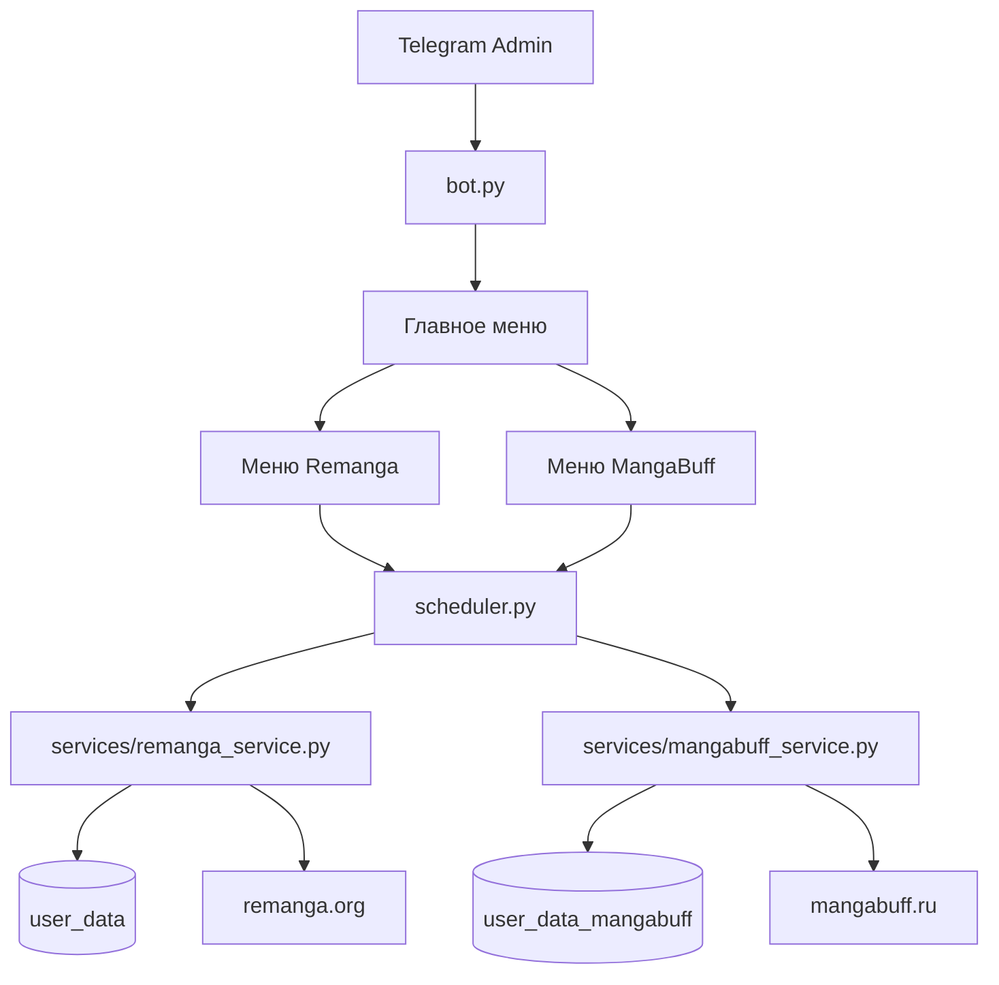

# Remanga + MangaBuff Autobot

Telegram-бот (aiogram 3.x) для автоматизации двух сайтов:

- **Remanga.org** — карточные бои murim-cards
- **MangaBuff.ru** — авточтение глав и сбор ежедневных наград/карт

Сессии браузера раздельные: `user_data/` (Remanga) и `user_data_mangabuff/` (MangaBuff).

## Возможности

### Remanga
- Persistent Playwright-профиль, без повторного логина
- Автобои / один бой / статус / рейтинг / уведомления
- Эмуляция человека (паузы, User-Agent, viewport)

### MangaBuff
- Отдельный профиль `user_data_mangabuff`
- Setup: ручной вход + сохранение cookies
- Авточтение: плавный скролл, пауза 5–15 с (настраивается), переход к следующей главе
- Сбор наград и карт (кнопки «Забрать», ежедневные бонусы)

## Структура

```
remanga_autobattle/
├── bot.py                      # Telegram UI (двухуровневое меню)
├── scheduler.py                # общий APScheduler
├── config.py / settings_store.py / stats_store.py
├── services/
│   ├── remanga_service.py      # бои Remanga
│   └── mangabuff_service.py    # чтение / награды MangaBuff
├── browser_service.py          # re-export для совместимости
├── user_data/                  # сессия Remanga
└── user_data_mangabuff/        # сессия MangaBuff
```

## Меню Telegram

**Главное меню** → выбор модуля:

| Модуль | Кнопки |
|---|---|
| ⚔️ Remanga.org | Автобой, 1 бой, статус, статистика, рейтинг, уведомления, настройки |
| 📚 MangaBuff.ru | Авточтение, собрать награды, задержка, URL чтения, статус |

## Установка на сервер

```bash
curl -fsSL https://raw.githubusercontent.com/asto7996-maker/fpc-plugins/cursor/remanga-autobattle-ba83/remanga_autobattle/install.sh | bash
```

Или вручную:

```bash
cd remanga_autobattle
python3 -m venv .venv && source .venv/bin/activate
pip install -r requirements.txt && playwright install chromium
cp .env.example .env   # указать BOT_TOKEN
python bot.py
```

| Что | Где |
|---|---|
| `BOT_TOKEN` | `.env` |
| Admin ID | первый `/start` |
| URL боёв Remanga, интервал | Telegram → Remanga → Настройки |
| URL чтения / задержка MangaBuff | Telegram → MangaBuff |

## Setup сессий (один раз)

### Remanga

```bash
systemctl stop remanga-autobattle   # на сервере
cd /root/remanga_autobattle && source .venv/bin/activate
python bot.py --setup
systemctl start remanga-autobattle
```

### MangaBuff

```bash
systemctl stop remanga-autobattle
cd /root/remanga_autobattle && source .venv/bin/activate
python bot.py --setup-mangabuff
# или: python -m services.mangabuff_service
systemctl start remanga-autobattle
```

1. Откроется Chromium (`headless=False`)
2. Пройдите DDoS-Guard / капчу
3. Войдите в аккаунт
4. Нажмите Enter в терминале — сессия сохранится

## Как это работает



## Замечания

- MangaBuff часто за DDoS-Guard — setup лучше делать с GUI/VNC на сервере или локально с копированием `user_data_mangabuff`
- Не ставьте слишком маленькие задержки/интервалы — сайты могут ограничить активность
- Автоматизация может нарушать правила сайтов — используйте на свой страх и риск
